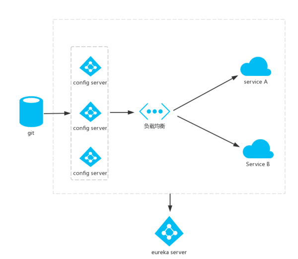
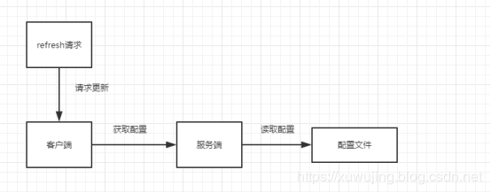
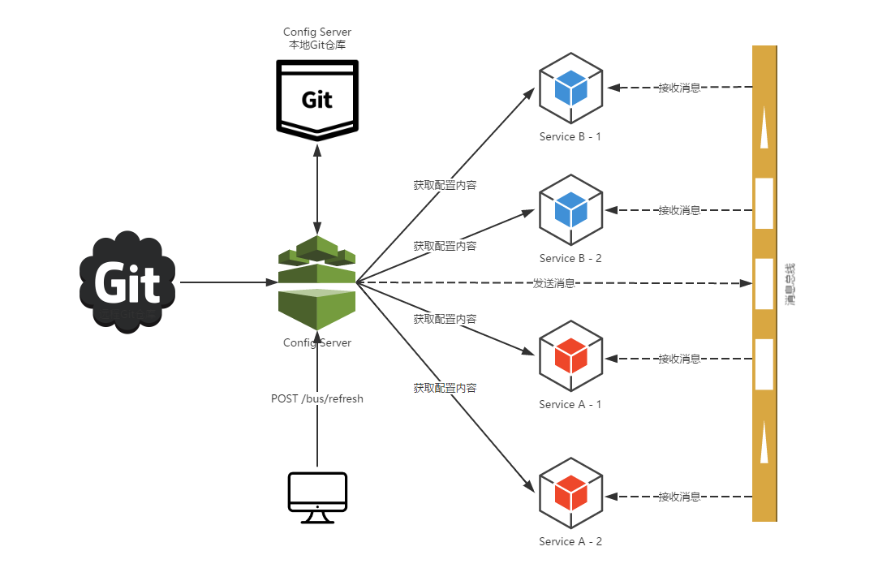

# Config
Spring Cloud Config项目是一个解决分布式系统的配置管理方案。它包含了Client和Server两个部分，server提供配置文件的存储、以接口的形式将配置文件的内容提供出去，client通过接口获取数据、并依据此数据初始化自己的应用。Spring cloud使用git或svn存放配置文件，默认情况下使用git。
    
    
仓库中的配置文件会被转换成web接口，访问可以参照以下的规则：
    
- /{application}/{profile}[/{label}]
- /{application}-{profile}.yml
- /{label}/{application}-{profile}.yml
- /{application}-{profile}.properties
- /{label}/{application}-{profile}.properties
    
# 高可用Config
  
    

# refresh
## config client refresh
curl -X POST http://localhost:9080/actuator/refresh 手动刷新客户端单个节点config。
    
  
    
## config bus refresh
curl -X POST http://localhost:8001/actuator/bus-refresh 在config server端触发消息代理(rabbitMQ / kafka)自动刷新所有节点config。
    
  
