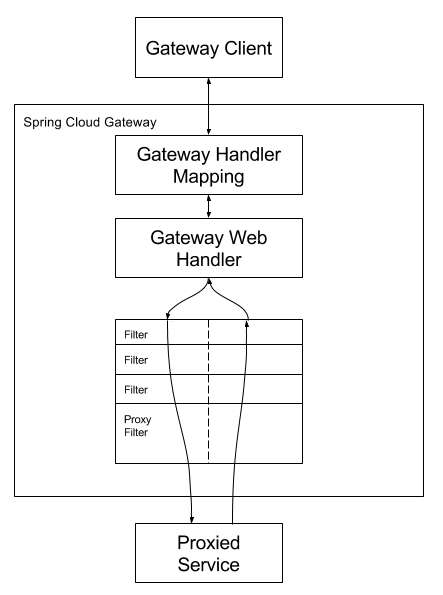

# Spring Cloud Gateway
Spring Cloud Gateway是Spring Cloud官方推出的第二代网关框架，用于取代Zuul网关。网关作为一个系统的流量的入口，在微服务系统中有着非常作用，网关常见的功能有路由转发、权限校验、限流控制等作用。
    

## Gateway工作流程
  
    
客户端向Spring Cloud Gateway发出请求。 如果Gateway Handler Mapping确定请求与路由匹配（predicate），则将其发送到Gateway web Handler处理。 Gateway web Handler处理请求时会经过一系列的过滤器链（filter）。 过滤器链可以在发送代理请求之前或之后执行过滤逻辑。 先执行所有“pre”过滤器逻辑，然后进行代理请求。 收到代理服务的响应之后执行“post”过滤器逻辑。
    
在执行所有“pre”过滤器逻辑时，往往进行了鉴权、限流、日志输出等功能，以及请求头的更改、协议的转换；转发收到响应之后，会执行所有“post”过滤器的逻辑，在这里可以对响应数据进行修改，比如响应头、协议的转换等。
    
    
## RouteDefinition
gateway网关启动时，路由信息默认会加载内存中，路由信息被封装到 RouteDefinition 对象中，配置多个RouteDefinition组成gateway的路由系统。
  
    

## Endpoint
Spring Cloud Gateway 提供了 Endpoint 端点，暴露路由信息，有获取所有路由、刷新路由、查看单个路由、删除路由等方法，想访问端点中的方法需要添加 spring-boot-starter-actuator 依赖，并在配置文件中暴露所有端点。
management.endpoints.web.exposure.include = *
    

## Route
    
  
    
    
### RouteLocatorBuilder
RouteLocatorBuilder用于自定义路由，除了建路由RouteLocatorBuilder可以让你添加各种predicates和filters，predicates断言的意思，顾名思义就是根据具体的请求的规则，由具体的route去处理，filters是各种过滤器，用来对请求做各种判断和修改。
    

## Predicate
Spring Cloud Gateway内置了许多Predicate实现:
    
  
    
datetime、cookie、header、host、method、path、querparam、remoteaddr等predicate实现，每一种predicate都会对当前的客户端请求进行判断，是否满足当前的要求，如果满足则交给当前请求处理。如果有很多个Predicate，并且一个请求满足多个Predicate，则按照配置的顺序第一个生效。
    

## Filter
Spring Cloud Gateway根据作用范围划分为GatewayFilter和GlobalFilter，二者区别如下：
- GatewayFilter : 需要通过spring.cloud.routes.filters 配置在具体路由下，只作用在当前路由上 或者 通过spring.cloud.default-filters配置在全局，作用在所有路由上
- GlobalFilter : 全局过滤器，不需要在配置文件中配置，作用在所有的路由上，最终通过GatewayFilterAdapter包装成GatewayFilterChain可识别的过滤器，它为请求业务以及路由的URI转换为真实业务服务的请求地址的核心过滤器，不需要配置，系统初始化时加载，并作用在每个路由上。
    
### GatewayFilter
GatewayFilter工厂在配置文件application.yml中配置，遵循了约定大于配置的思想，只需要在配置文件配置GatewayFilter Factory的名称，而不需要写全部的类名，比如AddRequestHeaderGatewayFilterFactory只需要在配置文件中写AddRequestHeader，而不是全部类名。
    
  
    
    
    
### GlobalFilter
    
    
    