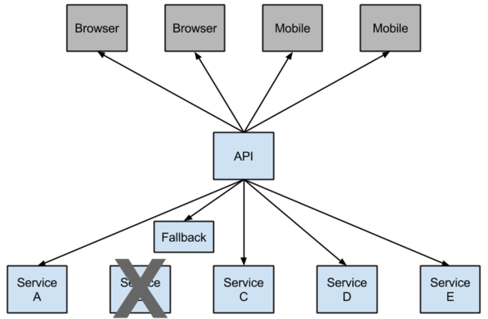

# 断路器（Hystrix）
在微服务架构中，根据业务来拆分成一个个的服务，服务与服务之间可以相互调用（RPC），在Spring Cloud可以用RestTemplate+Ribbon和Feign来调用。为了保证其高可用，单个服务通常会集群部署。由于网络原因或者自身的原因，服务并不能保证100%可用，如果单个服务出现问题，调用这个服务就会出现线程阻塞，此时若有大量的请求涌入，Servlet容器的线程资源会被消耗完毕，导致服务瘫痪。服务与服务之间的依赖性，故障会传播，会对整个微服务系统造成灾难性的严重后果，这就是服务故障的“雪崩”效应。
    
为了解决这个问题，业界提出了断路器模型。
    
# Netflix Hystrix
Netflix开源了Hystrix组件，实现了断路器模式，SpringCloud对这一组件进行了整合。 
    
该框架目标在于通过控制那些访问远程系统、服务和第三方库的节点，从而对延迟和故障提供更强大的容错能力。Hystrix具备了服务降级(fallback)、服务熔断(circuit breaker)、线程隔离、请求缓存、请求合并以及服务监控等强大功能。
    
当对特定的服务的调用的不可用达到一个阀值（Hystric 是5秒20次） 断路器将会被打开。
    
  
    
## @SpringCloudApplication
可以使用@SpringCloudApplication来开启具有断路器功能的springcloud应用。
    
```
@SpringBootApplication
@EnableDiscoveryClient
@EnableCircuitBreaker
public @interface SpringCloudApplication {}
```
这也意味着一个Spring Cloud标准应用应包含服务发现以及断路器。
    
## @EnableCircuitBreaker
@EnableCircuitBreaker用以启用断路器，通用注解。
    
## @EnableHystrix
@EnableHystrix用以启用Hystrix断路器组件，包含了启用断路器命令，用于netflix Hystrix组件。
    
```
@EnableCircuitBreaker
public @interface EnableHystrix {}
```
    
## @HystrixCommand
@HystrixCommand标注在方法上，对该方法创建熔断器的功能，并指定了fallbackMethod 服务降级的实现方法。
   
   
# Feign中使用断路器
## 启用hystrix
Feign默认集成了Hystrix组件，在D版本的Spring Cloud之后，它没有默认打开。需要在配置文件中配置打开它，在配置文件加以下代码：
    
```
feign.hystrix.enabled = true
```
    
## @FeignClient
在@FeignClient中注册fallback服务降级实现。
    
   
# Hystrix Dashboard
Hystrix-dashboard是一款针对Hystrix进行实时监控的工具，通过Hystrix Dashboard我们可以在直观地看到Hystrix Command的请求响应时间, 请求成功率等数据。
    
## @EnableHystrixDashboard
@EnableHystrixDashboard 启用 HystrixDashboard 断路器监控面板。
    
## dashboard 配置
SpringBoot2.x以上必须指定hystrix.stream节点，否则报 *Unable to connect to Command Metric Stream*。
    
```
management.endpoints.web.exposure.include = hystrix.stream
management.endpoints.web.base-path = /
```

或者
    
```
@Configuration
public class HystrixMetricsStreamConfig {

    @Bean
    public ServletRegistrationBean<Servlet> getServlet(){
        HystrixMetricsStreamServlet streamServlet = new HystrixMetricsStreamServlet();
        ServletRegistrationBean<Servlet> registrationBean = new ServletRegistrationBean<>(streamServlet);
        registrationBean.setLoadOnStartup(1);
        registrationBean.addUrlMappings("/hystrix.stream");
        registrationBean.setName("HystrixMetricsStreamServlet");
        return registrationBean;
    }
}
```
    
浏览器中输入: `http://localhost:9010/hystrix`    
  
    
可以通过该界面监控使用了hystrix dashboard的项目。依照提示在中间的输入框输入如下的地址:    
`http://localhost:9010/hystrix.stream`    
Hystrix Dashboard监控的界面:
  
    
- 实心圆：共有两种含义。它通过颜色的变化代表了实例的健康程度，如下图所示，它的健康度从绿色、黄色、橙色、红色递减。该实心圆除了颜色的变化之外，它的大小也会根据实例的请求流量发生变化，流量越大该实心圆就越大。

- 曲线：用来记录2分钟内流量的相对变化，我们可以通过它来观察到流量的上升和下降趋势。
