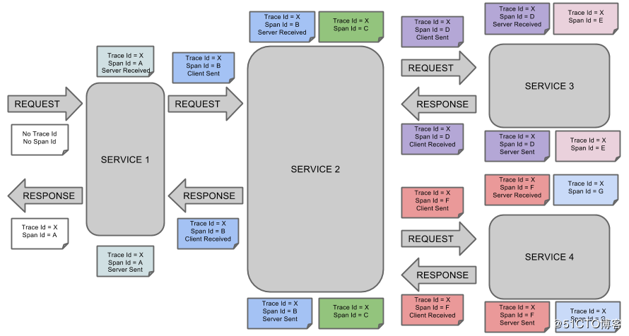
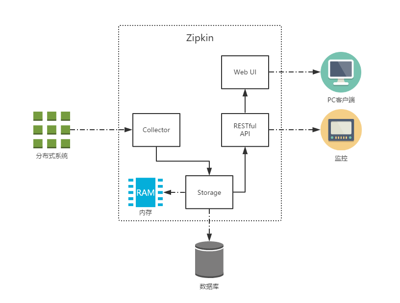

# 分布式服务跟踪
随着业务的发展，我们的系统规模也会变得越来越大，各微服务间的调用关系也变得越来越错综复杂。通常一个由客户端发起的请求在后端系统中会经过多个不同的微服务调用来协同产生最后的请求结果，在复杂的微服务架构系统中，几乎每一个前端请求都会形成一条复杂的分布式服务调用链路，在每条链路中任何一个依赖服务出现延迟过高或错误的时候都有可能引起请求最后的失败。这时候对于每个请求全链路调用的跟踪就变得越来越重要，通过实现对请求调用的跟踪可以帮助我们快速的发现错误根源以及监控分析每条请求链路上的性能瓶颈等好处。
    
针对上面所述的分布式服务跟踪问题，Spring Cloud Sleuth提供了一套完整的解决方案。
    
# sleuth
只需要在pom.xml中引入sleuth依赖即可，它会自动为当前应用构建起各通信通道的跟踪机制。
    
```
<dependency>
    <groupId>org.springframework.cloud</groupId>
    <artifactId>spring-cloud-starter-sleuth</artifactId>
</dependency> 
```    
    
控制台输出内容中，可以看到多了一些形如[trace-1,f410ab57afd5c145,a9f2118fa2019684,false]的日志信息，而这些元素正是实现分布式服务跟踪的重要组成部分。
- 第一个值：trace-1，它记录了应用的名称，也就是application.properties中spring.application.name参数配置的属性。
- 第二个值：f410ab57afd5c145，Spring Cloud Sleuth生成的一个ID，称为Trace ID，它用来标识一条请求链路。一条请求链路中包含一个Trace ID，多个Span ID。
- 第三个值：a9f2118fa2019684，Spring Cloud Sleuth生成的另外一个ID，称为Span ID，它表示一个基本的工作单元，比如：发送一个HTTP请求。
- 第四个值：false，表示是否要将该信息输出到Zipkin等服务中来收集和展示。
    
  
 
# zipkin
Zipkin是Twitter的一个开源项目，它基于Google Dapper实现。我们可以使用它来收集各个服务器上请求链路的跟踪数据，并通过它提供的REST API接口来辅助我们查询跟踪数据以实现对分布式系统的监控程序，从而及时地发现系统中出现的延迟升高问题并找出系统性能瓶颈的根源。除了面向开发的API接口之外，它也提供了方便的UI组件来帮助我们直观的搜索跟踪信息和分析请求链路明细。
    
  
    
主要有4个核心组件构成：
    
- Collector：收集器组件，它主要用于处理从外部系统发送过来的跟踪信息，将这些信息转换为Zipkin内部处理的Span格式，以支持后续的存储、分析、展示等功能。
- Storage：存储组件，它主要对处理收集器接收到的跟踪信息，默认会将这些信息存储在内存中，我们也可以修改此存储策略，通过使用其他存储组件将跟踪信息存储到数据库中。
- RESTful API：API组件，它主要用来提供外部访问接口。比如给客户端展示跟踪信息，或是外接系统访问以实现监控等。
- Web UI：UI组件，基于API组件实现的上层应用。通过UI组件用户可以方便而有直观地查询和分析跟踪信息。
    
    
# Sleuth与Zipkin整合
## 为应用引入和配置Zipkin服务
<dependency>
  <groupId>org.springframework.cloud</groupId>
  <artifactId>spring-cloud-sleuth-zipkin</artifactId>
</dependency>

## 增加Zipkin Server的配置信息
```
# zipkin server
spring.zipkin.base-url = http://localhost:9411
# 采样率 1 = 100%
spring.sleuth.sampler.percentage = 1
```
    
## 抽样收集
理论上来说，我们收集的跟踪信息越多就可以更好的反映出系统的实际运行情况，并给出更精准的预警和分析，但是在高并发的分布式系统运行时，大量的请求调用会产生海量的跟踪日志信息，如果我们收集过多的跟踪信息将会对我们整个分布式系统的性能造成一定的影响，同时保存大量的日志信息也需要不少的存储开销。所以，在Sleuth中采用了抽象收集的方式来为跟踪信息打上收集标记，也就是我们之前在日志信息中看到的第四个boolean类型的值，它代表了该信息是否要被后续的跟踪信息收集器获取和存储。
    
在Sleuth中的抽样收集策略是通过Sampler接口实现的。
    
```
public interface Sampler {
    /**
     * @return true if the span is not null and should be exported to the tracing system
    */
    boolean isSampled(Span span);
}
```
    
通过实现isSampled方法，Spring Cloud Sleuth会在产生跟踪信息的时候调用它来为跟踪信息生成是否要被收集的标志。需要注意的是，即使isSampled返回了false，它仅代表该跟踪信息不被输出到后续对接的远程分析系统（比如：Zipkin），对于请求的跟踪活动依然会进行，所以我们在日志中还是能看到收集标识为false的记录。
    
默认情况下，Sleuth会使用PercentageBasedSampler实现的抽样策略，以请求百分比的方式配置和收集跟踪信息，我们可以通过在application.properties中配置下面的参数对其百分比值进行设置，它的默认值为0.1，代表收集10%的请求跟踪信息。
    
```
spring.sleuth.sampler.percentage = 0.1
```
