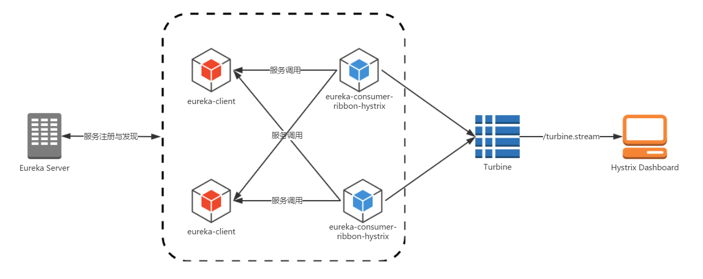

# 单点dashboard
  
    

# dashboard 聚合turbine
  
    
## 启用turbine
```
@EnableDiscoveryClient
@EnableHystrixDashboard
@EnableTurbine
```
    
## turbine配置
```
# eureka中的服务列表，标明监控哪些服务，多个服务以逗号分隔
turbine.app-config = hystrix-consumer,feign-consumer
# 指定聚合哪些集群，多个使用逗号分割，默认为default。
# 可使用turbine.stream?cluster={clusterConfig之一}访问
turbine.aggregator.clusterConfig = default
# 1. clusterNameExpression指定集群名称，默认表达式appName；此时：turbine.aggregator.clusterConfig需要配置想要监控的应用名称
# 2. 当clusterNameExpression: default时，turbine.aggregator.clusterConfig可以不写，默认就是default
# 3. 当clusterNameExpression: metadata['cluster']时，假设想要监控的应用配置了eureka.instance.metadata-map.cluster: ABC，则需要配置，
#    同时配置turbine.aggregator.clusterConfig: ABC
turbine.clusterNameExpression= new String("default")
# 被监控服务中配置的HystrixStreamServlet自动加载Bean中配置的一样
turbine.instanceUrlSuffix.default = hystrix.stream
```
    
## 通过消息代理收集聚合
Spring Cloud在封装Turbine的时候，还实现了基于消息代理的收集实现。所以，我们可以将所有需要收集的监控信息都输出到消息代理中，然后Turbine服务再从消息代理中异步的获取这些监控信息，最后将这些监控信息聚合并输出到Hystrix Dashboard中。
    
  

