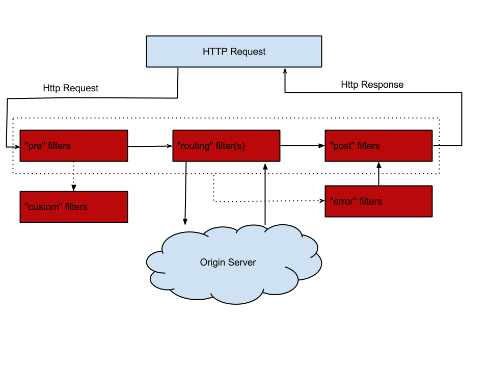

# 服务网关
服务网关是微服务架构中一个不可或缺的部分。通过服务网关统一向外系统提供REST API的过程中，除了具备服务路由、均衡负载功能之外，它还具备了权限控制等功能。Spring Cloud Netflix中的Zuul就担任了这样的一个角色，为微服务架构提供了前门保护的作用，同时将权限控制这些较重的非业务逻辑内容迁移到服务路由层面，使得服务集群主体能够具备更高的可复用性和可测试性。
   
# Zuul
在Spring Cloud Netflix中，Zuul巧妙的整合了Eureka来实现面向服务的路由。实际上，我们可以直接将API网关也看做是Eureka服务治理下的一个普通微服务应用。它除了会将自己注册到Eureka服务注册中心上之外，也会从注册中心获取所有服务以及它们的实例清单。所以，在Eureka的帮助下，API网关服务本身就已经维护了系统中所有serviceId与实例地址的映射关系。当有外部请求到达API网关的时候，根据请求的URL路径找到最佳匹配的path规则，API网关就可以知道要将该请求路由到哪个具体的serviceId上去。由于在API网关中已经知道serviceId对应服务实例的地址清单，那么只需要通过Ribbon的负载均衡策略，直接在这些清单中选择一个具体的实例进行转发就能完成路由工作了。
   
# 路由配置
## ribbon 路由，指定serviceId
```
zuul.routes.ribbon.path = /ribbon/**
zuul.routes.ribbon.serviceId = ribbon-consumer
zuul.routes.feign.path = /feign/**
zuul.routes.feign.serviceId = feign-consumer
```
    
## ribbon 路由，指定服务列表
```
zuul.routes.hello-service.path = /hello-service/**
# 这里的serviceId是由用户手工命名的服务名称，配合<serviceId>.ribbon.listOfServers参数实现服务与实例的维护。
zuul.routes.hello-service.serviceId = hello-service
# 由于zuul.routes.<route>.serviceId指定的是服务名称，默认情况下Ribbon会根据服务发现机制来获取配置服务名对应的eureka实例清单。
# 但是，静态路由时并没有整合类似Eureka之类的服务治理框架，所以需要将该参数设置为false，不然配置的serviceId是获取不到对应实例清单的。
#ribbon.eureka.enabled = false
# 与zuul.routes.<route>.serviceId的配置相对应，服务示例直接由配置给出，而不是从eureka查找
#hello-service.ribbon.listOfServers = http://localhost:9010/,http://localhost:9020/
```
    
## 指定url
```
zuul.routes.baidu.path = /baidu/**
zuul.routes.baidu.url = http://www.baidu.com
```
   
   
# 过滤器
每个客户端请求微服务应用提供的接口时，它们的访问权限往往都需要有一定的限制，系统并不会将所有的微服务接口都对它们开放。然而，目前的服务路由并没有限制权限这样的功能，所有请求都会被毫无保留地转发到具体的应用并返回结果，为了实现对客户端请求的安全校验和权限控制，最简单和粗暴的方法就是为每个微服务应用都实现一套用于校验签名和鉴别权限的过滤器或拦截器。不过，这样的做法并不可取，它会增加日后的系统维护难度，因为同一个系统中的各种校验逻辑很多情况下都是大致相同或类似的，这样的实现方式会使得相似的校验逻辑代码被分散到了各个微服务中去，冗余代码的出现是我们不希望看到的。所以，比较好的做法是将这些校验逻辑剥离出去，构建出一个独立的鉴权服务。
    
对于这样的问题，更好的做法是通过前置的网关服务来完成这些非业务性质的校验。由于网关服务的加入，外部客户端访问我们的系统已经有了统一入口，既然这些校验与具体业务无关，那何不在请求到达的时候就完成校验和过滤，而不是转发后再过滤而导致更长的请求延迟。同时，通过在网关中完成校验和过滤，微服务应用端就可以去除各种复杂的过滤器和拦截器了，这使得微服务应用的接口开发和测试复杂度也得到了相应的降低。
    
为了在API网关中实现对客户端请求的校验，我们将需要使用到Spring Cloud Zuul的另外一个核心功能：过滤器。
    
Zuul允许开发者在API网关上通过定义过滤器来实现对请求的拦截与过滤，实现的方法非常简单，我们只需要继承ZuulFilter抽象类并实现它定义的四个抽象函数就可以完成对请求的拦截和过滤了。
    
  
    

## 过滤器的实现
```
@Component
public class AccessFilter extends ZuulFilter {

    final Logger logger = LoggerFactory.getLogger(getClass());
    
    @Override
    public Object run() throws ZuulException {
        
        RequestContext ctx = RequestContext.getCurrentContext();
        HttpServletRequest request = ctx.getRequest();
        logger.info("method = {}, requestURL = {}", request.getMethod(), request.getRequestURL());
        String token = request.getParameter("token");
        if (StringUtils.isEmpty(token)) {
            logger.error("token is empty!");
            // 过滤该请求，不对其进行路由
            ctx.setSendZuulResponse(false);
            // 返回错误码
            ctx.setResponseStatusCode(401);
            // 返回错误提示
            ctx.setResponseBody("token is empty!");
            // 设置context属性，可以在下一个filter的shouldFilter()里读取，以判断是否需要进行filter逻辑判断
            ctx.set("isSuccess", false);
            return null;
        } else {
            logger.info("token = {}", token);
            // 对该请求进行路由
            ctx.setSendZuulResponse(true);
            ctx.setResponseStatusCode(200);
            // 增加request Header
            ctx.addZuulRequestHeader("X-AUTH-ID", token);
            ctx.set("isSuccess", true);
            return null;
        }
    }
    
    @Override
    public boolean shouldFilter() {
        return true;
    }

    // pre / route / post / error
    @Override
    public String filterType() {
        return FilterConstants.PRE_TYPE;
    }

    @Override
    public int filterOrder() {
        return 0;
    }
}
```
- filterType：过滤器的类型，它决定过滤器在请求的哪个生命周期中执行。这里定义为pre，代表会在请求被路由之前执行。
- filterOrder：过滤器的执行顺序。当请求在一个阶段中存在多个过滤器时，需要根据该方法返回的值来依次执行。数字越大，优先级越低。
- shouldFilter：判断该过滤器是否需要被执行。这里我们直接返回了true，因此该过滤器对所有请求都会生效。实际运用中我们可以利用该函数来指定过滤器的有效范围。
- run：过滤器的具体逻辑。这里我们通过ctx.setSendZuulResponse(false)令zuul过滤该请求，不对其进行路由，然后通过ctx.setResponseStatusCode(401)设置了其返回的错误码，当然我们也可以进一步优化我们的返回，比如，通过ctx.setResponseBody(body)对返回body内容进行编辑等。
   

# 服务降级
当我们的zuul进行路由分发时，如果后端服务不可用或者调用超时，这时候我们希望Zuul提供一种降级功能，而不是将异常暴露出来。zuul上实现服务降级需要实现FallbackProvider的接口。实现接口中的两个方法:getRoute()用于指定应用在哪个服务上；fallbackResponse()进入降级的执行逻辑。
    
```
@Component
public class FallbackHandler implements FallbackProvider {

    final Logger logger = LoggerFactory.getLogger(FallbackHandler.class);
    
    @Override
    public String getRoute() {
        // 支持服务降级的服务id，如果需要所有调用都支持回退，则返回 "*"
        return "*";
    }

    @Override
    public ClientHttpResponse fallbackResponse(String route, Throwable cause) {
        if (cause != null) {
            String reason = cause.getMessage();
            logger.info("Excption {}",reason);
        }
        return fallbackResponse(route);
    }
    
    public ClientHttpResponse fallbackResponse(String route) {
        
        return new ClientHttpResponse() {
            @Override
            public HttpStatus getStatusCode() throws IOException {
                // 网关向api服务请求是失败了，但是消费者客户端向网关发起的请求是OK的，不应该把api的404, 500等问题抛给客户端
                return HttpStatus.OK;
            }
            @Override
            public int getRawStatusCode() throws IOException {
                return HttpStatus.OK.value();
            }
            @Override
            public String getStatusText() throws IOException {
                return HttpStatus.OK.getReasonPhrase();
            }
            @Override
            public void close() {

            }
            @Override
            public InputStream getBody() throws IOException {
                return new ByteArrayInputStream((route + " is unavailable.").getBytes());
            }
            @Override
            public HttpHeaders getHeaders() {
                HttpHeaders headers = new HttpHeaders();
                // ContentType必须是request里accept的类型
                headers.setContentType(MediaType.APPLICATION_JSON);
                return headers;
            }
        };
    }
}
```
    

# 重试
有时候因为网络或者其它原因，服务可能会暂时的不可用，这个时候我们希望可以再次对服务进行重试，Zuul也帮我们实现了此功能，需要结合Spring Retry 一起来实现。
    
首先在spring-cloud-zuul项目中添加Spring Retry依赖。
    
```
<dependency>
    <groupId>org.springframework.retry</groupId>
    <artifactId>spring-retry</artifactId>
</dependency>
```
    
配置文件中配置启用Zuul Retry。
    
```
#是否开启重试功能
zuul.retryable = true
#对当前服务的重试次数
ribbon.MaxAutoRetries = 2
#切换相同Server的次数
ribbon.MaxAutoRetriesNextServer = 0
```
    

# 高可用
不同的客户端使用不同的负载将请求分发到后端的Zuul，Zuul在通过Eureka调用后端服务，最后对外输出。因此为了保证Zuul的高可用性，前端可以同时启动多个Zuul实例进行负载，在Zuul的前端使用Nginx或者F5进行负载转发以达到高可用性。
    
  

